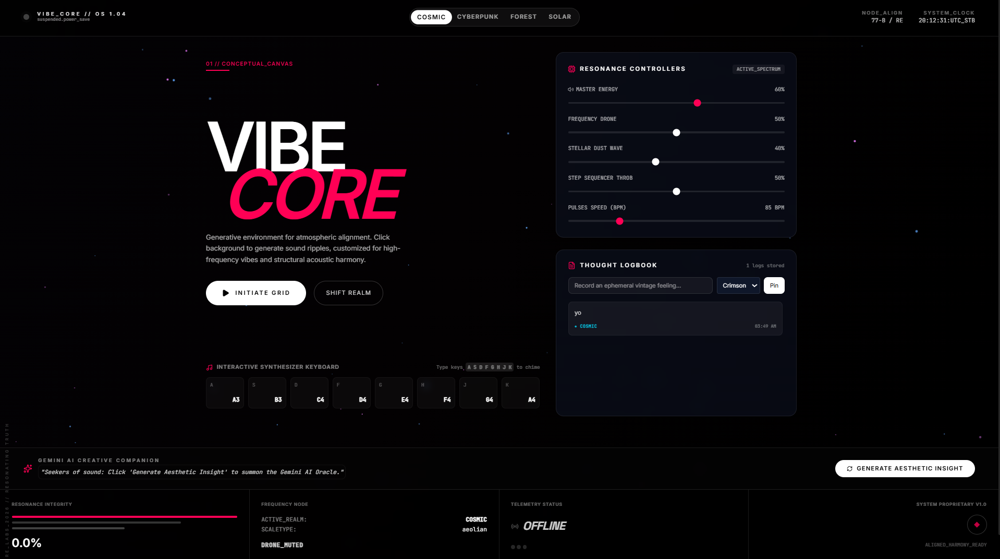
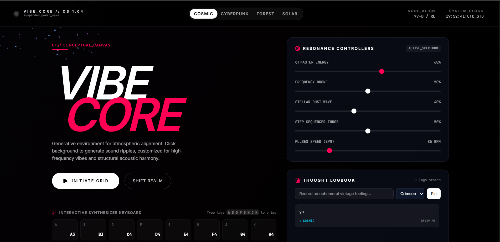
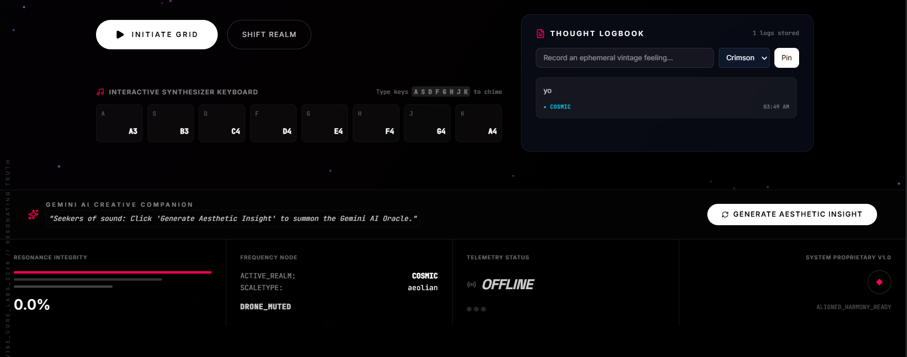
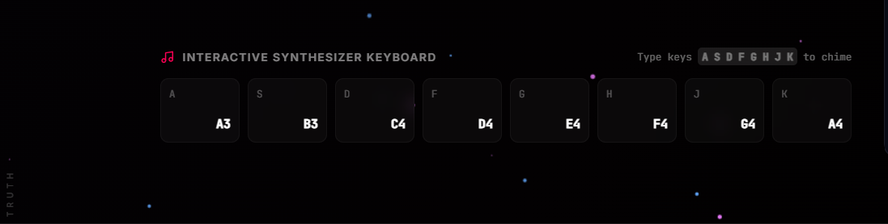
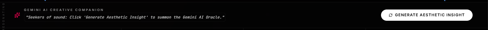

# 🎨 Vibe Sandbox

An interactive environment featuring generative Web Audio soundscapes, customizable aesthetic canvases, mood journaling, and AI-powered inspiration generation.

## ✨ Features

- **🎵 Generative Web Audio Soundscapes** - Create and explore dynamic, AI-powered audio experiences
- **🎭 Customizable Aesthetic Canvases** - Design and personalize visual environments
- **📔 Mood Journaling** - Track and reflect on your emotional state with an intuitive journaling interface
- **💡 AI-Powered Inspiration** - Get creative suggestions and prompts powered by AI

## 🚀 Getting Started

### Prerequisites

- Node.js (v16 or higher)
- npm or yarn
- A Gemini API key from [Google AI Studio](https://ai.google.dev)

### Installation

1. Clone the repository:
   ```bash
   git clone https://github.com/muraa-p/vibe-sandbox.git
   cd vibe-sandbox
   ```

2. Install dependencies:
   ```bash
   npm install
   ```

3. Create a `.env.local` file in the root directory and add your API key:
   ```bash
   GEMINI_API_KEY=your_gemini_api_key_here
   ```

4. Run the development server:
   ```bash
   npm run dev
   ```

5. Open your browser and navigate to `http://localhost:3000`

## 📸 Screenshots

<!-- Placeholder for the whole screenshots -->


<!-- Placeholder for feature screenshots -->


<!-- Placeholder for mood journaling interface -->


<!-- Placeholder for audio canvas -->


<!-- Placeholder for AI inspiration -->


## 🛠️ Tech Stack

- **Frontend Framework:** React with TypeScript
- **Styling:** CSS3
- **AI Integration:** Google Generative AI (Gemini API)
- **Web Audio API:** For dynamic soundscapes
- **Build Tool:** Next.js

### Language Composition
- TypeScript: 97.8%
- CSS: 1.7%
- HTML: 0.5%

## 📦 Available Scripts

### Development
```bash
npm run dev
```
Runs the app in development mode with hot reload.

### Build
```bash
npm run build
```
Creates an optimized production build.

### Production
```bash
npm start
```
Runs the production build server.

## 🔑 Environment Variables

Create a `.env.local` file with the following variables:

```env
GEMINI_API_KEY=your_gemini_api_key_here
```

To get a Gemini API key:
1. Visit [Google AI Studio](https://ai.studio)
2. Click "Get API Key" 
3. Create a new project or select an existing one
4. Copy your API key and paste it into `.env.local`

## 🎯 Project Structure

```
vibe-sandbox/
├── assets/              # Static assets and screenshots
├── components/          # React components
├── pages/               # Next.js pages
├── styles/              # Global CSS styles
├── public/              # Public static files
├── .env.local          # Environment variables (not tracked)
└── package.json         # Dependencies and scripts
```

## 🚀 Deployment

You can deploy this app to various platforms:

### Deploy on Vercel (Recommended)
```bash
npm install -g vercel
vercel
```

### Deploy on Other Platforms
The app can be deployed on any Node.js hosting platform like Netlify, Heroku, or Railway.

## 🤝 Contributing

Contributions are welcome! Please feel free to submit a Pull Request.

1. Fork the repository
2. Create your feature branch (`git checkout -b feature/amazing-feature`)
3. Commit your changes (`git commit -m 'Add amazing feature'`)
4. Push to the branch (`git push origin feature/amazing-feature`)
5. Open a Pull Request

## 📝 License

This project is licensed under the MIT License - see the LICENSE file for details.

## 🙋 Support

If you encounter any issues or have questions, please open an [issue](https://github.com/muraa-p/vibe-sandbox/issues) on GitHub.

## 🎉 Acknowledgments

- Built with [Google Generative AI](https://ai.google.dev)
- Inspired by interactive art and emotional wellness technology
- Thanks to the open-source community

---

**Happy creating! 🎨🎵**
